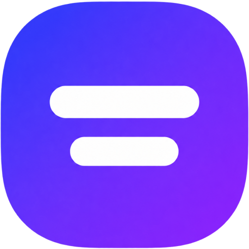

<div align="center">



# Metrics Adda

**Fast, free unit converters and everyday text tools — no sign-up, nothing to install.**

Every conversion, count and generation runs in your browser. Nothing you type is sent anywhere.

[**metricsadda.com**](https://www.metricsadda.com) · [Tools](#tools) · [Getting started](#getting-started) · [Contributing](.github/CONTRIBUTING.md) · [Changelog](CHANGELOG.md)

[](https://github.com/moulibheemaneti/metrics-adda/actions/workflows/ci.yml) [](https://github.com/moulibheemaneti/metrics-adda/releases/latest) [](LICENSE) [](https://nuxt.com) [](https://bun.sh) [](#pwa)

</div>

---

## Tools

Each tool is its own indexable page, with its own title, description, OG card
and structured data.

| Route | What it does |
| --- | --- |
| `/weight-converter` | kg, g, mg, tonnes, oz, lb, stone, US tons |
| `/height-converter` | cm and metres ⇄ feet and inches, plus all length units |
| `/temperature-converter` | Celsius, Fahrenheit, kelvin |
| `/speed-converter` | km/h, mph, m/s, ft/s, knots |
| `/volume-converter` | ml, litres, m³, and US **and** imperial gallons, pints, cups |
| `/area-converter` | mm², cm², m², hectares, km², in², ft², yd², acres, mi² |
| `/time-converter` | ms, seconds, minutes, hours, days, weeks, years |
| `/data-storage-converter` | bits, bytes, decimal KB–PB **and** binary KiB–PiB |
| `/percentage-calculator` | Percent of a number, percent change, increase and decrease |
| `/age-calculator` | Age in years, months and days, plus your next birthday |
| `/word-counter` | Words, characters, sentences, paragraphs, reading time |
| `/case-converter` | UPPER, lower, Title, Sentence, camelCase, snake_case + 4 more |
| `/base64-encoder` | Encode and decode base64, UTF-8 and URL-safe alphabet |
| `/typing-speed-test` | Timed WPM test with accuracy and a personal best |
| `/bmi-calculator` | Body mass index, its category, and the healthy weight range |
| `/lorem-ipsum-generator` | Placeholder text by the paragraph, sentence or word |
| `/uuid-generator` | Random v4 UUIDs, up to 100 at a time, in four formats |
| `/password-generator` | Strong random passwords with an entropy readout |

Adding a tool means three things: an entry in `app/utils/tools.ts`, a copy block
in `app/utils/copy.ts`, and a page in `app/pages/`. `test/unit/tools.test.ts`
fails if those drift apart.

All conversion, counting and generation runs client-side — nothing a visitor
types is sent anywhere.

---

## Design

Indigo on cool slate, with Sora for headings and Inter for everything else.
Both fonts are self-hosted from `public/fonts/` — see the README there.

Colours live as CSS custom properties in `app/assets/scss/base/_global.scss`,
with the dark counterpart of every one in `app/assets/scss/themes/_dark.scss`.
Two rules worth knowing before changing them:

- **The accent is two tokens, not one.** `--accent` is the ink (links, active
  nav, hairlines) and lifts in dark mode so it stays readable; `--accent-solid`
  is the fill (buttons, checked boxes) and deliberately holds still, so
  `--accent-contrast` keeps its 6.7:1. Using `--accent` as a fill will fail
  contrast in dark mode.
- **Indigo is load-bearing.** The password strength meter uses red / amber /
  green semantically. A brand colour from any of those families would make a
  meter state indistinguishable from ordinary chrome.

Theme preference is system / light / dark, stored in `localStorage` under
`ma-theme`, where "system" is the *absence* of the key and of the `data-theme`
attribute. An inline script in `nuxt.config.ts` applies a stored choice before
first paint; without it, dark-mode visitors get a white flash on every load.

Both themes are audited with axe-core at WCAG 2.1 AA on every route.

---

## Tech Stack

- **Framework** — [Nuxt 4](https://nuxt.com)
- **Runtime** — [Bun](https://bun.sh)
- **Language** — TypeScript
- **Styling** — SCSS
- **Linting** — ESLint + Stylelint
- **Testing** — Vitest (`unit`, `nuxt` and `scss` projects)
- **PWA** — `@vite-pwa/nuxt` (installable, works offline)
- **Deployment** — Vercel

---

## Prerequisites

- [Bun](https://bun.sh) `>= 1.3.14`

---

## Getting Started

```bash
# Clone the repo
git clone https://github.com/moulibheemaneti/metrics-adda.git
cd metrics-adda

# Install dependencies (also sets up the commitguard git hooks automatically)
bun install

# Start development server
bun dev
```

App runs at `http://localhost:3000`

---

## Available Scripts

| Command | Description |
|---|---|
| `bun dev` | Start development server |
| `bun run build` | Build for production |
| `bun preview` | Preview production build locally |
| `bun lint` | Run Stylelint + ESLint across the project |
| `bun lint:fix` | Run both linters and auto-fix issues |
| `bun typecheck` | Run TypeScript type check (`vue-tsc`) |
| `bun run test` | Run the full Vitest suite once |
| `bun test:watch` | Run Vitest in watch mode |
| `bun seo:verify` | Boot the production build and smoke-test every SEO surface |
| `bun seo:lighthouse` | Run Lighthouse CI against the production build |
| `bun pwa:verify` | Check the build is installable and precaches every route |
| `bun play:assets` | Generate the Play Store icon and feature graphic |
| `bun play:screenshots` | Capture Play Store screenshots from the built site |
| `bun clean` | Remove `.nuxt`, `.output` and `dist` |

---

## Project Structure

```
.
├── app/
│   ├── assets/scss/     # 7-1 SCSS architecture (abstracts, base, layout…)
│   ├── components/      # Vue components
│   ├── composables/     # Composition API composables
│   ├── layouts/         # Nuxt layouts
│   ├── pages/           # File-based routing
│   └── utils/           # Auto-imported utility functions
├── public/              # Publicly served static files (see its README)
├── scripts/pwa/         # Installability + offline precache check
├── scripts/seo/         # SEO smoke test + Lighthouse CI runners
├── test/
│   ├── nuxt/            # Tests that need the Nuxt runtime
│   ├── scss/            # sass-true tests for SCSS functions
│   └── unit/            # Plain-Node unit tests
├── .github/             # GitHub templates, Actions, CODEOWNERS
├── nuxt.config.ts       # Nuxt configuration
└── eslint.config.mjs    # ESLint configuration
```

---

## Testing

Vitest runs three projects in one pass (see `vitest.config.ts`):

- **`unit`** — plain Node. Import modules relatively, not via `~`.
- **`nuxt`** — real Nuxt runtime, so auto-imports and composables resolve.
- **`scss`** — [sass-true](https://github.com/oddbird/true) suites for the
  SCSS functions in `app/assets/scss/abstracts/`.

```bash
bun run test
```

---

## PWA

The site is installable and works offline. That is close to free here: every
tool already computes in the browser and talks to nothing, so once the shell
is cached there is no second thing to make work.

Two pieces make it true, and both live in `nuxt.config.ts`:

- **Every route is prerendered.** `nitro.prerender` crawls from `/`, which
  reaches all 22 pages because every tool cross-links every other one. A
  service worker can only precache files that exist at build time, so without
  this an offline visit to a page you had not already opened would miss.
- **The worker precaches the shell** — markup, JS, CSS, both webfonts, the
  favicon and the header mark. Deliberately *not* the manifest icons: the OS
  reads those at install time and the page never does, so precaching them
  would add ~650 KB per install for nothing.

Icons and their two opacity quirks are documented in
[`public/README.md`](public/README.md).

### The install button

`components/InstallButton.vue`, rendered by the footer. It captures
Chromium's `beforeinstallprompt` and uses it to open the install dialog on
demand.

It does **not** call `preventDefault()` on that event, which means
Chromium's own install banner still appears. That is the point: the banner
is full-width, top of the viewport and shown at a moment the browser chose,
which is a far better ask than anything in a footer. The two run together —
the banner catches first-time visitors, and this button is the standing
fallback for anyone who dismissed it or came back later.
`test/nuxt/install-prompt.nuxt.test.ts` asserts the call is absent, because
re-adding it would quietly remove the banner again.

Three constraints shaped the button itself, and all three are why it is
quiet and in the footer rather than a banner of our own:

- **It cannot be an interstitial.** App-install interstitials are what
  Google's intrusive-interstitial treatment was introduced for, and organic
  search is this site's entire acquisition channel. Not a trade worth making.
- **It cannot be in the header.** The topbar's single-row width is measured
  to the pixel in `layouts/default.vue` (`$single-row: 60rem` comes from
  brand + toggle + nav = 946px). A fifth item would push that breakpoint up
  for everyone — including the Safari and Firefox visitors who can never
  install anything.
- **It cannot shift layout.** It appears mid-session, and CLS ≤ 0.1 is an
  error-level CI gate. It takes a wrapped line at the end of the footer, so
  the document grows downward with nothing beneath it to displace. Measured
  at exactly 0 shift.

It is Chromium-only by nature — Safari has never implemented the event and
iOS install is manual via Share → Add to Home Screen, so on those browsers
it renders nothing at all. That is deliberate: a button that cannot do
anything is worse than no button.

Note that Lighthouse never sees it, because `beforeinstallprompt` does not
fire in an audit run. Its accessible name, contrast and behaviour are
covered by `test/nuxt/install-prompt.nuxt.test.ts` instead.

### Checking it

```bash
bun pwa:verify
```

Asserts the manifest, the icons it promises, the worker, and a precache entry
plus a `<link rel="manifest">` for all 22 routes. It runs in CI after the
build, reading `.output/public` directly, so it costs no extra build.

It exists because **Lighthouse cannot check any of this any more** — the PWA
category and its `installable-manifest` / `service-worker` audits were removed
in Lighthouse 12, so `bun seo:lighthouse` is blind to it. The failure mode is
silent: `<link rel="manifest">` comes from a `<VitePwaManifest />` in
`app/app.vue` that renders `null`, and deleting it still builds, still
installs a worker, and quietly stops the site being installable.

---

## Android / Play Store

The site ships to Google Play as a **Trusted Web Activity**: a thin Android
shell that renders `https://www.metricsadda.com` in full Chrome with no
address bar. Not a WebView, and not a second copy of the app.

That buys one thing worth stating plainly — **a content change needs no Play
release.** Deploy to Vercel and every installed app has it on next launch.
Only the shell itself — icons, name, package id, target SDK, shortcuts — needs
a new bundle, which is roughly once a year.

It works because the site is already an installable PWA with a stable manifest
`id`. That id is the identity Play uses to keep an updated TWA the *same* app,
which is why `bun pwa:verify` asserts it.

| Path | What |
|---|---|
| `android/twa-manifest.json` | The only hand-written Android config |
| `android/README.md` | Setup, build loop, and the CI notes |
| `scripts/android/target-sdk.sh` | Forces the Play-mandated target API level |
| `public/.well-known/assetlinks.json` | Proves the app and the site share an owner |
| `play-assets/` | Store icon, feature graphic, screenshots |
| `.github/workflows/android.yml` | Builds the signed bundle on demand |

```bash
bun run play:assets        # store icon + feature graphic
bun run play:screenshots   # 24 shots, phone/tablet x light/dark
```

Two things bite hard enough to be worth knowing before you touch any of it:

- **`twa-manifest.json` has no `targetSdkVersion`.** The level comes from
  Bubblewrap's project template and lands in a `build.gradle` that every
  `bubblewrap update` regenerates, so `scripts/android/target-sdk.sh` has to
  run after the update on every build. It fails loudly rather than quietly,
  because the alternative is a bundle that builds and installs and is then
  refused at upload.
- **Wrong asset links show as a browser address bar**, not as an error. The
  fingerprints cannot be filled in until Play has seen the first bundle, so
  `assetlinks.json` ships with an empty list and `bun pwa:verify` reports it
  as pending rather than failing.

The full release runbook, Play Console checklist and store listing copy are in
[`docs/plans/android-twa-play-store.md`](docs/plans/android-twa-play-store.md).

---

## Git Workflow

See [`.github/BRANCHING.md`](.github/BRANCHING.md) for the full branching strategy.

**Quick summary:**
- `main` is the only long-lived branch — branch off it, and never push to it directly
- Use `type/short-description` branch names (e.g. `feat/user-auth`)
- Commit messages follow [Conventional Commits](https://www.conventionalcommits.org/)
- Open a PR to `main`

---

## Code Style

Enforced on every commit by [commitguard](https://github.com/moulibheemaneti/commitguard)
(see `commitguard.yaml`):

- **ESLint** — TypeScript and Vue rules, and formatting via `@stylistic`
  (there is no Prettier in this project)
- **Stylelint** — SCSS rules, including BEM class naming
- **`bun typecheck`** — runs before every commit
- **Conventional commits** — validated on the commit message

---

## Releases

Versioning and `CHANGELOG.md` are automated by
[semantic-release](https://semantic-release.gitbook.io/) (`release.config.mjs`),
driven by the commit history. `main` is the only release branch — every push to
it is evaluated, and `feat:` / `fix:` commits since the last tag decide the
version bump. There is no pre-release channel.

---

## Environment Variables

Copy `.env.example` to `.env` and fill in the values:

```bash
cp .env.example .env
```

> ⚠️ Never commit `.env` — it is gitignored.

---

## Deployment

This project is deployed on **Vercel**. Every push to `main` triggers a production deploy automatically.

---

## License

[MIT](LICENSE)
